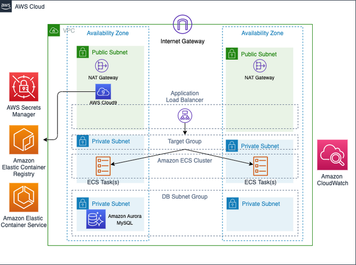
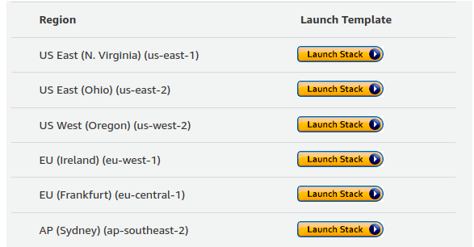

# .Net Web Application
#### Deploy a .NET Web Application on Amazon ECS powered by Graviton2

This project consists of building a container image for an ASP.NET MVC 5 web application and deploy it onto an Amazon ECS cluster powered by Graviton2 instances. 

As part of this process, the AWS CLI will be use to create the container image for ARM architecture and push it to Amazon ECR which is a managed private repository service on AWS. Then to create a highly available Amazon ECS cluster with ARM based instances. Using AWS CloudFormation will launch a cluster of worker nodes on Amazon EC2, then launch a containerized Movie application onto your cluster. 

### What is Amazon ECS?

 Amazon ECS stands for Amazon Elastic Container Service, is a highly scalable, reliable, secure, fast container management service that makes it easy to run, stop, and manage containers on a cluster. without having to worry about running your own cluster management and container orchestration software. 
 
 Because ECS has been a foundational pillar for key Amazon services, it can natively integrate with other services such as Amazon Route 53, AWS Secrets Manager, AWS Identity and Access Management (IAM) and Amazon CloudWatch providing a familiar experience to deploy and scale containers. ECS is also able to quickly integrate with other AWS services to bring new capabilities to ECS.

AWS announced new EC2 instance types will be powered by the AWS Graviton2 processor. This processor is based on he ARM64 architecture leveraging 64-bit ARM Neoverse N1 cores; which make the Graviton2 instances about 20% less expensive per hour than Intel x86 instances with up to 40% better performance.

### Prerequisites

* AWS Account with administrator-level access.

* Recommended browser: he latest version of Chrome or Firefox 

* Foundational knowledge on AWS, CloudFormation, Docker and Linux 

### Application Architecture
This project uses Amazon ECS, Amazon EC2 ARM based instance, and Elastic Load Balancing as pictured below:

### Modules

This project is divided into seven short modules. They are the followings:

**1-** **Set up your environment**: Install and configure your test environment with the prerequisites to create the Docker image, and deploy it into Amazon ECS. 

**2-** **Set up AWS Cloud9 Workspace**: Open your Cloud9 IDE to initialize your workspace and download the sample application’s source code into your environment.

**3-** **Create and Publish Docker Image**: Create a Dockerfile, with instructions to build an ARM64 container image, and then publish it to Amazon ECR. 

**4-** **Create an Amazon ECS Cluster**: Create an Amazon ECS cluster with ARM based instances.

**5-** **Deploy the Application to Amazon ECS**: Create a task definition with Auto Scaling.

**6-** **Monitoring and Logging**: Enable monitoring for ECS environment using Amazon CloudWatch Container Insights.

**7-** **Clean up**: To finish this experiment, you will clean up the resources created in this lab.

### Module 1: Set up Your Environment

This module requires the configuration of an environment using [AWS CloudFormation](https://aws.amazon.com/cloudformation) template.

**CloudFormation template** basically describes the desired resources and their dependencies so that developers can launch and configure them together as a stack.

#### Implementation
Instructions below will deploy an environment in AWS account. The deployed resources consists of 
* An AWS Cloud9 IDE for your development purpose.
* A db.t3.small Amazon Aurora with MySQL compatibility for database.
* An AWS Secrets Manager.
* Two NAT Gateways, and all necessary roles and security groups.

The followings steps will show how set up the CloudFormation environment.

Select an AWS region, 

After the AWS region selection, which will then lead to AWS CloudFormation Service - Create Stack screen.